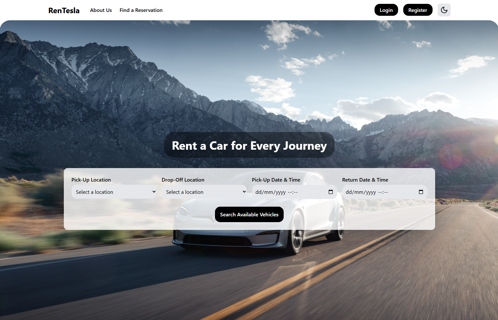
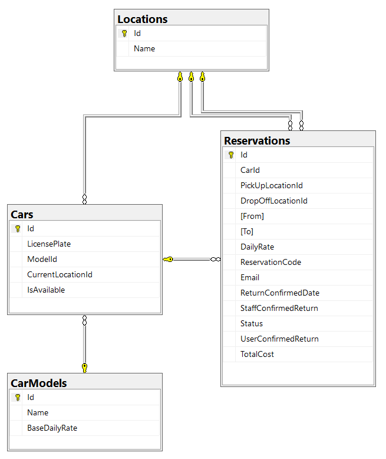

# RenTesla
A modern Tesla rental platform designed for tourists and locals in Mallorca. It simplifies the booking process, offers flexible pricing, and provides both user and staff interfaces for streamlined management.

Built with React, .NET 9, SQL Server and Docker.

*Note: This project is for demonstration purposes and is not production-ready. I plan to continue improving it as I learn more about frontend technologies.*

## Tech Stack
#### Frontend
- React (Vite) with TypeScript
- Tailwind CSS
- React Router
- Axios

#### Backend
- ASP.NET Core 9 Web API 
- SQL Server
- Entity Framework Core 
- ASP.NET Core Identity
- Scalar documentation

The application is fully containerized using Docker Compose for easy setup in isolated containers.

## Features
- **Search Availability:** View available Tesla models based on location and rental period.
- **Flexible Pricing:** Hourly rate capped at the daily rate (e.g., 3 hours = hourly price, 10+ hours = daily rate up to 24 hours).
- **Make Reservations:** Submit a booking for a specific time and location.
- **Search Reservations:** Search for a booking with your reservation code and email when not logged in.
- **User Accounts:** Users can book without registering or create an account during checkout.
- **User History:** Users can view their active and past reservations.
- **Confirm Car Return:** Users can confirm car return online via their account.
- **Staff Panel:** Staff can confirm returned cars on a designated panel.
- **Responsive UI:** Optimized for both mobile and desktop devices.
- **Light and Dark Mode** 

## How To Run
Run `docker-compose up` in the repository's root directory.

Optionally you can view and modify variables in `.env` file.

The UI can be developed locally while connecting to either a local or in-container backend, with no additional configuration needed.

Staff panel can be accessed for demo purposes via account with credentials: 

**email:** `smithjohn@rentesla.com` 

**password:** `Staff123.`

## Database Schema

